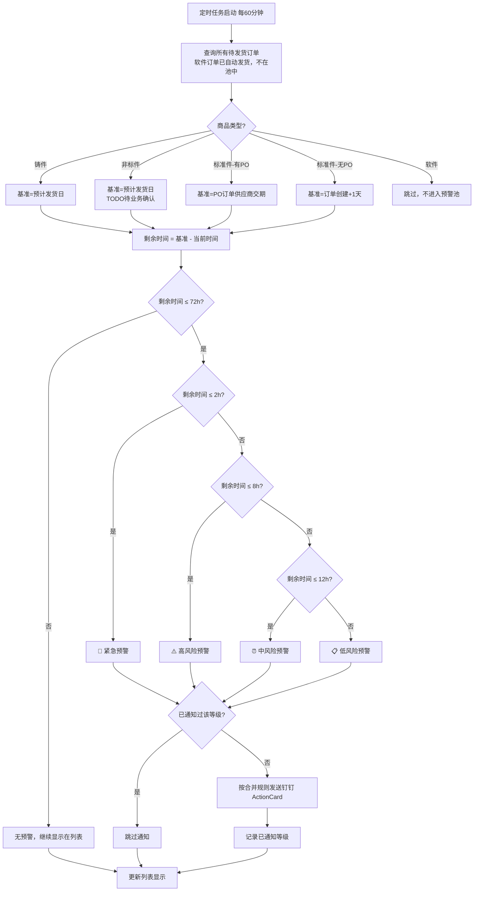
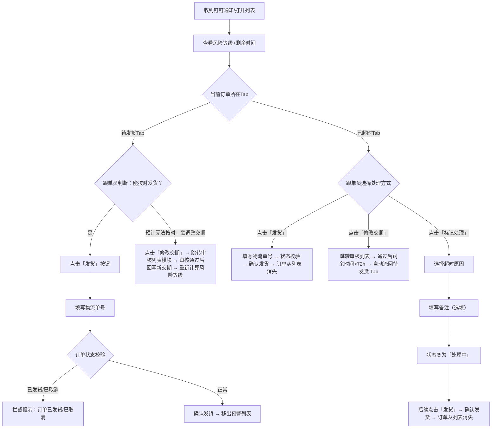

# 发货超时预警功能 PRD

## 文档信息

| 字段 | 内容 |
|------|------|
| 文档名称 | 发货超时预警功能 |
| 版本 | v2.2 |
| 作者 | 产品经理 |
| 创建日期 | 2026-06-23 |
| 最后更新 | 2026-08-11 |
| 状态 | 待研发交接 |

**原型文件：** `03_原型设计/商家后台/01_待发货列表_发货预警.html`

---

## 1. 背景与目标

### 1.1 背景

跟单员每天处理大量待发货订单，靠人工巡查哪些即将超时，效率低、容易遗漏。超时后才被发现，错过最佳处理时机。

**现有后台能力：**
- 已有「待发货列表」，含 待发货/已超时/今日发货 三个Tab
- 仓库和跟单员都在同一个钉钉群

**现有不足：**
- 没有预警通知，靠人工巡查
- 没有分级风险标识
- 没有超时处理记录

### 1.2 上线后影响

- 超时发货率下降
- 客户投诉率下降
- 跟单员处理效率提升

### 1.3 目标

1. **按商品类型分档预警**：不同商品类型使用不同基准（铸件=预计发货日；标准件-库存=订单创建+1天；标准件-PO采购=PO订单供应商交期；非标件=预计发货日（兜底）；**软件订单不进入预警池**，付款后自动发邮箱，状态=已发货）
2. **分级处理**：按剩余时间分为4级，红色紧急优先
3. **钉钉通知（统一一套）**：4级 ActionCard 卡片，emoji 区分等级，合并规则按等级生效，**取消"提前催办"双轨机制**
4. **交期管理**：待发货 Tab 提供"修改交期"入口（走审核列表模块），不重复开发弹窗

---

## 2. 用户角色与故事

| 角色 | 身份 | 用户故事 |
|------|------|---------|
| 跟单员 | 负责跟单的人员 | 想要<看到哪些订单即将超时>，以便<优先处理紧急订单> |
| 仓库人员 | 仓库打包发货 | 想要<实时知道哪些单需要优先发货>，以便<提前准备货物> |
| 商家管理员 | 老板/主管 | 想要<掌握整体超时风险>，以便<监控团队情况> |

### 2.1 跟单员完整操作场景

| 场景 | 触发条件 | 系统响应 | 跟单员操作 |
|------|---------|---------|-----------|
| 上班查看 | 每天9:00上班 | 显示预警列表 | 查看今日待处理订单 |
| 收到钉钉通知 | 系统扫描到风险等级 | 钉钉推送 ActionCard | 打开列表处理 |
| 处理发货 | 点击「发货」 | 弹出填写物流单号 | 输入物流单号确认发货 |
| 超时后标记处理 | 订单超时进入已超时Tab后，点击「标记处理」 | 弹出标记处理弹窗 | 选择超时原因+填写备注（可多次记录，追加到处理时间线） |
| 修改交期 | 点击「修改交期」（待发货Tab） | 跳转审核列表模块 | 在审核列表完成交期变更 |

### 2.2 仓库人员操作场景

| 场景 | 触发条件 | 系统响应 | 仓库操作 |
|------|---------|---------|--------|
| 收到钉钉通知 | 高风险/紧急订单 | 钉钉 ActionCard 推送 | 提前备货 |
| 查看发货任务 | 点击卡片链接 | 跳转列表 | 打包发货 |

### 2.3 管理员操作场景

| 场景 | 触发条件 | 系统响应 | 管理员操作 |
|------|---------|---------|-----------|
| 查看整体风险 | 打开列表 | 显示统计 | 监控超时率 |
| 查看超时记录 | 查看详情 | 显示处理时间线 | 追溯问题 |

---

## 3. 功能需求

### 3.1 功能拆解清单

| # | 功能模块 | 功能名称 | 功能描述 | 优先级 |
|---|---------|---------|---------|--------|
| 1 | 预警引擎 | 风险等级计算 | 按商品类型分档计算剩余时间，判定4级风险（详见 §3.2.1） | Must |
| 2 | 预警引擎 | 预警升级规则 | 单向升级：低→中→高→紧急，每等级只通知1次；修改交期后允许等级回落并清零通知记录 | Must |
| 3 | 预警引擎 | 定时扫描 | 每60分钟扫描所有待发货订单（不含软件），计算风险等级 | Must |
| 4 | 预警引擎 | 软件订单过滤 | 软件订单（自动发邮箱）不进入预警池，状态=已发货 | Must |
| 5 | 预警引擎 | 标准件分档 | 标准件按"是否有PO订单"自动分档：有PO→供应商交期；无PO→订单创建+1天 | Must |
| 6 | 钉钉通知 | 4级 ActionCard | 4级统一 ActionCard 卡片，emoji 区分等级（🚨⚠️⏰📋），群消息推送 | Must |
| 7 | 钉钉通知 | 预警合并策略 | 🚨不合并 / ⚠️按跟单员合并 / ⏰按仓库合并 / 📋全部合并1条 | Must |
| 8 | 待发货Tab | 风险预警列 | 新增「风险预警」列，显示4级色块标签 | Must |
| 9 | 待发货Tab | 剩余时间列 | 新增「剩余时间」列，倒计时格式 | Must |
| 10 | 待发货Tab | 列表排序 | 风险等级高→低置顶，同等级内按剩余时间升序 | Must |
| 11 | 待发货Tab | 修改交期入口 | 操作列提供"修改交期"按钮，点击跳转至【审核列表-修改交期】流程（弹窗+审批由审核列表模块负责） | Must |
| 12 | 已超时Tab | 处理状态列 | 新增「处理状态」列（待处理/处理中；已完成订单确认发货后从列表消失） | Must |
| 13 | 已超时Tab | 处理记录弹窗 | 「处理记录」只读查看处理时间线；「标记处理」弹窗同时显示历史时间线+新增表单 | Must |
| 14 | 已超时Tab | 超时原因记录 | 点击「标记处理」必填超时原因 | Must |
| 15 | 预警引擎 | 防重复发货提交 | 发货确认时校验订单状态：若订单已发货/已取消，二次提交直接拦截；并发场景下后端通过状态机+分布式锁保证只成功一次 | Must |
| 16 | 订单详情 | 修改交期入口 | 订单详情页基础信息区提供"修改交期"按钮，点击跳转至已有【审核列表-修改交期】流程 | Must |
| 17 | 今日发货Tab | 商品类型列 | 新增「商品类型」列（标准件/铸件/软件/非标件） | Should |
| 18 | 统计指标 | 数据统计 | 展示各风险级别订单数量统计 | Should |

> **说明：** #15 防重复发货与 §6 验收标准第10条对齐；#16 修改交期入口不展开弹窗/审批字段——这些由审核列表模块 PRD 负责。

---

### 3.2 功能一：风险等级预警

#### 3.2.1 风险等级定义

**预警范围**：距超时判断线 ≤ 72小时（3天）开始提醒。

| 等级 | 标识 | 剩余时间 | 行背景色 |
|------|------|---------|---------|
| 🚨 紧急 | 🚨 | ≤ 2小时 | 红色浅底 |
| ⚠️ 高风险 | ⚠️ | 2小时 < 时间 ≤ 8小时 | 橙色浅底 |
| ⏰ 中风险 | ⏰ | 8小时 < 时间 ≤ 12小时 | — |
| 📋 低风险 | 📋 | 12小时 < 时间 ≤ 72小时 | — |
| — 无需提醒 | — | > 72小时 | — |

#### 3.2.2 超时判断基准（按商品类型分档）

**核心逻辑**：不同商品类型使用不同基准字段计算"剩余时间"。

| 商品类型 | 超时判断基准 | 备注 |
|---------|-------------|------|
| **铸件** | **预计发货日** | 由供应商交期 + 客户交期共同确定；可通过"修改交期"调整 |
| **非标件** | **预计发货日** | 兜底方案；**🟡 TODO**：待业务确认是否需要按"委外/现货"细分 |
| **标准件 - 库存件** | **订单创建时间 + 1天** | 系统判断"无PO订单"即视为库存件 |
| **标准件 - PO采购** | **PO订单供应商交期** | 系统判断"有PO订单"即用对应PO的应到货日 |
| **软件** | ❌ **不进入预警池** | 付款后自动发邮箱，订单状态=已发货，不参与扫描 |

**判断逻辑（系统实现）：**

```
对每个待发货订单的标准件明细行：
  1. 查询该明细行是否挂 PO 订单
  2. 有 PO 订单 → 基准 = PO 应到货日（供应商交期）
  3. 无 PO 订单 → 基准 = 订单创建时间 + 1天
  4. 计算 剩余时间 = 基准 - 当前时间
  5. 按剩余时间落入对应等级
```

**铸件/非标件无交期时**：客户交期/供应商交期必须填写，若未填写则暂按"订单创建+7天"兜底计算。跟单员手动设置交期后系统即切换为正常铸件规则。

**修改交期后**：
- 以新的预计发货日/PO交期重新起算剩余时间
- 系统实时重新计算风险等级（**允许等级降低**）
- 已发出的各级别通知记录**随之清零**，后续触发新预计发货日下的完整通知流程
- **已超时订单**：若修改交期后剩余时间>72h，自动从「已超时 Tab」流回「待发货 Tab」

#### 3.2.3 提醒时间点

- 剩余时间 ≤ 72小时（3天）：开始提醒
- 通知触发时机（与等级入口对齐）：12小时（进入中风险）、8小时（进入高风险）、2小时（进入紧急）

> **v2.0 删除 4h 触发点**：4h 落在高风险(2-8h)区间内，非等级入口，v2.0 统一机制下不再单独触发通知，该时间点为 v1.x 提前催办机制残留。

#### 3.2.4 升级规则

```
状态单向升级：低 → 中 → 高 → 紧急（正常情况不可回落）
每等级只通知1次，不重复打扰
超时后移入「已超时」Tab，不再触发新等级预警
```

**修改交期后的特殊处理：**
- 允许等级回落：修改交期视为"重新起算"，新预计发货日对应的剩余时间决定新等级（可从高降到低）
- 通知记录清零：以新预计发货日重新积累各级别通知记录，每个等级在新时间轴下可再次触发通知
- 已超时订单：若新交期下剩余时间>72h，自动流回「待发货 Tab」

#### 3.2.5 列表排序规则

**待发货Tab：**
1. 🚨紧急订单（按剩余时间升序，红色置顶）
2. ⚠️高风险订单（按剩余时间升序）
3. ⏰中风险订单（按剩余时间升序）
4. 📋低风险订单（按剩余时间升序）
5. 无风险订单（按订单创建时间升序）

**已超时Tab：**
- 第1排序（绝对优先）：按逾期时长降序（超时越久越靠前）
- 第2排序（同逾期时长时）：按处理状态（待处理 > 处理中）

> 详见 §3.4.6 排序规则完整定义。

#### 3.2.6 异常情况

| 场景 | 处理方式 |
|------|---------|
| 订单已发货 | 确认发货后自动移出当前Tab（待发货/已超时均消失），不再出现在列表 |
| 订单已取消 | 自动移出预警列表 |
| 订单已删除 | 跳过处理 |
| 软件订单 | 付款后自动发邮箱，状态=已发货，不进入预警池，不参与扫描 |
| 修改交期后等级降低 | 以新预计发货日重算，等级可降低，已发出通知记录清零，后续重新积累 |
| 修改交期后已超时订单 | 若新剩余时间>72h，自动从「已超时 Tab」流回「待发货 Tab」 |
| 并发重复发货 | 后端通过订单状态机+分布式锁保证只成功一次；前端展示拦截提示"该订单已发货/已取消" |

---

### 3.3 功能二：钉钉群通知（统一机制）

> **v2.0 重构说明：** 取消 v1.x 的"提前催办"双轨机制，**只保留一套基于剩余时间触发的钉钉群通知**。每等级只发1次，升级到新等级时按新等级的合并规则重新发。视觉上靠 emoji 区分等级，**所有卡片均为同一种 ActionCard 类型**（钉钉机器人不支持设置卡片背景色）。

#### 3.3.1 推送策略

| 等级 | 触发条件 | 卡片形式 | emoji | 合并规则 |
|------|---------|---------|-------|---------|
| 🚨 紧急 | 剩余时间 ≤ 2h | ActionCard | 🚨 | 不合并，逐条发送 |
| ⚠️ 高风险 | 2h < 剩余 ≤ 8h | ActionCard | ⚠️ | 按跟单员合并 |
| ⏰ 中风险 | 8h < 剩余 ≤ 12h | ActionCard | ⏰ | 按仓库合并 |
| 📋 低风险 | 12h < 剩余 ≤ 72h | ActionCard | 📋 | 全部合并1条 |

> **@策略：** 4 个等级均不@个人/不@所有人，仅群消息可见。

#### 3.3.2 升级衔接规则

- **单向升级**：低 → 中 → 高 → 紧急（不可回落，**除非触发"修改交期"**——见 §3.2.4）
- **每等级只通知1次**，升级到新等级时按新等级的合并规则重新发
- **同等级内不再重复推送**

#### 3.3.3 触发时机

- 系统每 60 分钟扫描一次（与现有规则一致）
- 等级升级时立即触发一次新等级通知
- 订单已发货/已取消 → 停止推送

#### 3.3.4 卡片示例（ActionCard 格式）

**单条卡片（🚨 紧急 / ⚠️ 高风险，单条不合并场景）：**

```
🚨【紧急预警】订单 SO20260618001
───────────────────────────
剩余时间：32 分钟
商品：H13模具钢 100×50×20mm × 5件
跟单员：张三（华东仓库）
预警基准：预计发货日 06-18 15:32
商品类型：铸件
───────────────────────────
[立即处理] → 点击跳转列表
```

**合并卡片（⚠️ 高风险按跟单员合并示例）：**

```
⚠️【高风险】您有 3 条订单需要处理
───────────────────────────
张三（华东仓库）：2 条
李四（华南仓库）：1 条
───────────────────────────
[立即处理] → 点击跳转列表
```

**合并卡片（⏰ 中风险按仓库合并示例）：**

```
⏰【中风险】华东仓库有 5 条订单待处理
───────────────────────────
[立即处理] → 点击跳转列表
```

**合并卡片（📋 低风险全合并示例）：**

```
📋【通知】您有 12 条订单即将超时
───────────────────────────
[立即处理] → 点击跳转列表
```

#### 3.3.5 异常处理

| 场景 | 处理方式 |
|------|---------|
| Webhook 调用失败 | 重试 3 次，间隔 5 分钟 |
| 3 次失败后 | 记录错误日志 + 发送管理员告警 |
| 订单发货后 | 停止推送 |
| 订单取消后 | 停止推送 |
| 软件订单 | 不进入预警池，不会触发任何通知 |

---

### 3.4 功能三：预警列表（商家端）

#### 3.4.1 页面结构

**复用现有「待发货列表」页面，不新建独立模块：**

> **交互说明：** 点击列表每行的「展开」按钮，可在当前行下方展开显示订单明细信息，再次点击「收起」按钮可折叠。

```
待发货列表
├── [待发货] Tab  ← 核心改动点
│   ├── 顶部统计：🚨紧急N条 / ⚠️高N条 / ⏰中N条 / 📋低N条
│   ├── 新增「风险预警」列（显示在紧急程度后）
│   ├── 新增「剩余时间」列（显示在风险预警后）
│   ├── 操作列新增「修改交期」按钮
│   └── 列表按风险等级+剩余时间排序
├── [已超时] Tab  ← 增强
│   ├── 顶部统计：今日超时N条 / 本周超时N条 / 待处理N条
│   ├── 新增「处理状态」列
│   └── 新增「处理记录」弹窗
└── [今日发货] Tab  ← 增强
    └── 新增「商品类型」列
```

#### 3.4.2 待发货Tab字段

| 字段 | 说明 |
|------|------|
| ☐ | 全选/勾选 |
| 企业名称 | — |
| SO单号 | 蓝色链接 |
| 订单状态 | 格式：待发货：1项10件 |
| PO收货 | 格式：23/30（红色未完成/黑色完成） |
| 支付时间 | — |
| 紧急程度 | 标签 |
| 备注 | — |
| [新] 风险预警 | 色块标签 🚨⚠️⏰📋 |
| [新] 剩余时间 | 倒计时，颜色跟随等级 |
| 操作 | 发货/销售单/送货单/[修改交期]/更多/展开 |

**展开行字段：** 物料名称、商品类型（标准件/铸件/软件/非标件）、供应商名称、交收方式、跟单员、**预计发货日 / PO 交期**（红色高亮，即超时判断线，精确到时分秒，格式：YYYY-MM-DD HH:mm:ss）

> **v2.0 新增说明：** 操作列的「修改交期」按钮点击后**跳转至【审核列表-修改交期】流程**（由审核列表模块提供），不在本页面展开弹窗。

#### 3.4.3 已超时Tab字段

| 字段 | 说明 |
|------|------|
| ☐ | 全选/勾选 |
| 企业名称 | — |
| SO单号 | 蓝色链接 |
| 订单状态 | 格式：待发货：1项10件 |
| PO收货 | 格式：23/30 |
| 支付时间 | — |
| 紧急程度 | 标签 |
| 备注 | — |
| 逾期时长 | 红色加粗，格式：已超时 2小时15分 |
| [新] 处理状态 | 状态标签（待处理/处理中） |
| 操作 | 发货/[新]标记处理（可多次）/[新]处理记录/[修改交期]/更多/展开 |

> **操作列说明：** 按钮按状态动态变化，详见§3.4.7。待处理显示「发货/标记处理/修改交期」；处理中显示「发货/标记处理（追加记录）/处理记录/修改交期」。「修改交期」任意状态均显示。开发不应在所有行显示全部按钮。

#### 3.4.4 今日发货Tab字段

| 字段 | 说明 |
|------|------|
| [新] 商品类型 | 标签：标准件(蓝)/铸件(橙)/软件(紫)/非标件(粉) |

---

#### 3.4.5 字段显示逻辑

| 字段 | 显示规则 |
|------|---------|
| [新] 风险预警 | 剩余时间≤72h显示对应等级标签（🚨⚠️⏰📋），>72h显示"—" |
| [新] 剩余时间 | 倒计时格式，颜色跟随风险等级：红色(紧急≤2h)/橙色(高2-8h)/黄色(中8-12h)/蓝色(低12-72h)/灰色(>72h无提醒)；基于后端返回的 deadline 时间戳（精确到秒）在前端计算，每分钟刷新显示；倒计时归零时前端立即调接口触发流转，不等60分钟扫描 |
| [新] 处理状态 | 待处理(黄底) / 处理中(蓝底)；确认发货后订单从列表消失 |
| [新] 商品类型 | 今日发货Tab/展开行特有，标准件(蓝 #E8F0FF) / 铸件(橙 #FFF7E6) / 软件(紫 #F0F0FF) / 非标件(粉 #FFF1F0) |
| 展开行-基准时间 | **红色高亮**，即超时判断线，精确到时分秒（铸件/非标件=预计发货日；标准件-库存=订单创建+1天；标准件-PO采购=PO 订单供应商交期） |
| 展开行-交期字段 | 标准件-库存显示"—"（无单独交期）；标准件-PO采购显示"PO 订单供应商交期"；铸件/非标件显示"预计发货日" |

#### 3.4.6 列表排序规则

**待发货Tab排序（优先级从高到低）：**

| 优先级 | 风险等级 | 排序方式 | 说明 |
|-------|---------|---------|------|
| 1（最高） | 🚨 紧急 | 按剩余时间升序 | 越紧急越靠前 |
| 2 | ⚠️ 高风险 | 按剩余时间升序 | 越紧急越靠前 |
| 3 | ⏰ 中风险 | 按剩余时间升序 | 越紧急越靠前 |
| 4 | 📋 低风险 | 按剩余时间升序 | 越紧急越靠前 |
| 5 | — 无风险 | 按订单创建时间升序 | 按时间顺序 |

> **注意：** 同等级内按剩余时间升序，不同等级按优先级排序。紧急订单行显示红色背景，高风险订单行显示橙色背景。

**已超时Tab排序：**

| 排序维度 | 排序方式 | 说明 |
|---------|---------|------|
| 第1排序（绝对优先） | 按逾期时长降序 | 超时越久越靠前，不受处理状态影响 |
| 第2排序（同逾期时长时） | 按处理状态 | 待处理 > 处理中 |

> **注意：** 第1排序绝对优先。处理状态仅在逾期时长完全相同时作为次要参考。

#### 3.4.7 状态流转规则

**处理状态流转图：**
```
待发货（待发货Tab）
    │
    │ 预计发货日到期（系统自动流转）
    ↓
已超时Tab - 待处理（黄色标签）
    │
    ├── 点击"标记处理" → 选择原因+填写备注 → 处理中（蓝色标签）
    │       ↓ 可继续多次点击「标记处理」追加记录（状态保持处理中）
    │
    └── 点击"发货" → 填写物流单号 → 订单从列表消失

[特殊路径：修改交期回流]
已超时Tab - 任意状态
    │
    │ 点击"修改交期" → 跳转审核列表 → 通过后新交期下剩余时间>72h
    ↓
自动流回待发货 Tab（按新交期计算风险等级）
```

**状态字段说明：**

| 状态 | 标签颜色 | 触发条件 | 可执行操作 | 已超时Tab是否显示 |
|------|---------|---------|-----------|-----------------|
| 待处理 | 黄色 #FFF7E6 | 预计发货日到期后自动流转 | 发货 / 标记处理 / 修改交期 | ✅ 显示 |
| 处理中 | 蓝色 #E8F0FF | 首次点击"标记处理"后 | 发货 / 标记处理（追加记录）/ 处理记录（查看）/ 修改交期 | ✅ 显示 |
| — | — | 确认发货完成后 | — | ❌ 从列表消失（不再显示） |

> **关于"标记处理"：** 类似于订单备注，允许多次记录，每次点击追加一条时间线记录，首次操作将状态改为"处理中"，后续操作不再改变状态只追加记录。此操作**仅适用于已进入"已超时Tab"的订单**——跟单员提前知道某订单无法发货时无需提前操作，系统会在预计发货日到期时自动流转，超时后再点击表明"我在处理"即可。

**超时自动流转：** 预计发货日到期后，系统自动将订单从"待发货Tab"移入"已超时Tab"，状态默认为"待处理"。

---

### 3.5 功能四：处理记录

#### 3.5.1 处理状态流转

```
待发货 → 超时(移入已超时Tab) → 待处理 → 处理中 → 确认发货 → 订单从列表消失
                                                ↑                                ↓
                                                └────── 修改交期回流 ←────────────┘
                                                       （剩余时间>72h）
```

#### 3.5.2 操作与弹窗对应

| 当前状态 | 点击操作 | 触发弹窗 | 状态变化 |
|---------|---------|---------|---------|
| 待发货 | 点击「修改交期」 | 跳转至【审核列表-修改交期】流程 | 审核通过后变更预计发货日/PO交期，系统重新计算风险等级 |
| 待发货/已超时 | 点击「发货」 | 发货确认弹窗 | 确认发货 → 订单从列表消失（支持分批次发货，已发商品不可重复勾选） |
| 已超时-任意状态 | 点击「修改交期」 | 跳转至【审核列表-修改交期】流程 | 审核通过后重算风险等级；若新剩余时间>72h 自动流回待发货 Tab |
| 已超时-待处理 | 点击「标记处理」 | 标记处理弹窗 | 选择超时原因 → 填写备注 → 首次变为处理中 |
| 已超时-处理中 | 点击「标记处理」 | 标记处理弹窗 | 追加一条处理记录到时间线（状态不变，仍为处理中） |
| 已超时-处理中 | 点击「发货」 | 发货确认弹窗 | 确认发货 → 订单从列表消失 |
| 已超时-任意状态 | 点击「处理记录」 | 处理记录弹窗 | 查看处理时间线（只读，不改变状态） |

#### 3.5.3 弹窗场景说明

**修改交期入口（v2.0 简化）**
- 触发：点击「修改交期」按钮（待发货Tab 或 已超时Tab 任意状态）
- 场景：跟单员需要调整预计发货日/PO 交期
- 交互：点击后**跳转至审核列表模块的【修改交期】流程**，弹窗/审批/状态机由审核列表模块负责
- 后续：审核列表回写新交期后，预警引擎自动重算风险等级，已超时订单自动流回待发货 Tab
- 注意：本 PRD 不展开修改交期弹窗字段/审批流程/状态机——这些由审核列表模块 PRD 负责

**发货确认弹窗**
- 触发：点击「发货」按钮
- 场景：跟单员确认可以按时发货，填写物流信息完成发货
- 交互：填写物流单号（必填）→ 填写备注（选填）→ 确认发货
- v2.0 新增：发货前校验订单状态，已发货/已取消的二次提交直接拦截，提示"该订单已发货/已取消"

**标记处理弹窗**
- 触发：点击「标记处理」按钮
- 场景：跟单员判断无法按时发货，记录超时原因
- 交互：
  - **上方**：历史处理时间线（倒序排列，每条显示：操作人 + 操作时间 + 行为内容）
  - **下方**：新增表单（超时原因必填 / 备注选填 / 确认按钮）
- 首次操作将状态改为「处理中」，后续追加只写入时间线，状态不变

**处理记录弹窗**
- 触发：点击「处理记录」按钮
- 场景：只读查看订单的处理历史（不新增）
- 交互：时间线倒序展示（操作人 + 操作时间 + 行为内容），无新增表单
- v2.0 调整：处理记录弹窗中的"新增处理记录"下拉**取消"退款处理"选项**（v1.x 残留，v2.0 删除）

> **两个弹窗的区别**：「标记处理」= 历史时间线 + 新增表单；「处理记录」= 历史时间线（只读）。时间线数据相同，入口和功能不同。

#### 3.5.4 超时原因选项

- 仓库备货延迟
- 物流问题
- 商品缺货
- 买家延期（保留——与退款功能无关，是业务客观状态）
- 其他

> **v2.0 调整：** v1.x 中"退款"相关的按钮/选项/弹窗全部移除（详见 §8 变更记录）。

---

## 4. 核心流程

### 4.1 系统预警流程



> ⚠️ **补充说明（2026-08-10）**：流程图里 D1（铸件）/D2（非标件）的基准都写"预计发货日"，但这个基准来自客户/供应商交期，交期没填的情况下，见§3的兜底规则——暂按"订单创建+7天"计算，等跟单员补录交期后系统自动切换回正常规则。这条兜底分支流程图里没画出来，容易被开发漏掉，实现时D1/D2分支要加一个"有没有交期"的判断，没有交期时走兜底基准。

### 4.2 跟单员处理流程

> **说明：** "能按时发货"是跟单员根据实际情况判断（跟单员主观决定），不是系统自动判断。



### 4.3 订单发货完整生命周期

```
订单创建（基准：按商品类型分档；标准件-库存=订单创建+1天，标准件-PO采购=PO 交期，铸件/非标件=预计发货日；软件→已发货，不进池）
    │
    ▼
系统定时扫描（每60分钟，软件订单跳过）
    │
    ▼
T-72h（距基准72小时）────── 📋 低风险预警开始
    │
    ▼
T-12h ────────────────────── ⏰ 中风险预警
    │
    ▼
T-8h ─────────────────────── ⚠️ 高风险预警
    │
    ▼
T-2h ─────────────────────── 🚨 紧急预警
    │
    ▼
T+0（基准到期）────────────── 移入「已超时Tab - 待处理」
    │
    ▼
跟单员处理
    ├── 点击「发货」→ 状态校验 → 确认发货 → 订单从列表消失
    ├── 点击「标记处理」→ 选择原因 → 处理中 → 后续点击「发货」→ 订单从列表消失
    └── 点击「修改交期」→ 跳转审核列表 → 通过后新交期剩余时间>72h → 自动流回待发货 Tab（重新积累通知）
```

---

## 5. 非功能性需求

| 类型 | 要求 |
|------|------|
| 性能 | 预警扫描单次不超过5秒 |
| 实时性 | 剩余时间倒计时每分钟刷新；后端 API 返回 deadline Unix 时间戳，前端自算；倒计时归零时若页面正在展示，前端主动调接口触发流转；后端60分钟扫描兜底保证所有过期订单均被流转，不依赖前端在线 |
| 扫描策略 | 常规每60分钟扫描一次；剩余时间≤2h的订单放入加速队列，每10分钟补扫一次，降低通知延迟 |
| 可用性 | 钉钉通知送达率≥99% |
| 兼容性 | Chrome/Edge/Safari |

---

## 6. 验收标准

- [ ] 待发货列表显示4级风险预警标签（🚨⚠️⏰📋）
- [ ] 剩余时间倒计时实时更新，颜色跟随等级
- [ ] 红色紧急订单在列表最前面
- [ ] 钉钉群推送4级 ActionCard 卡片（emoji 区分，群消息可见，不@）
- [ ] 同等级不重复通知；修改交期后通知记录清零，重新起算
- [ ] 已超时Tab只显示待处理/处理中订单；确认发货后从列表消失
- [ ] 「标记处理」可多次点击追加记录，首次操作将状态改为处理中
- [ ] 超时原因必填
- [ ] 处理记录时间线可查看，支持追加新记录
- [ ] 防重复发货：已发货/已取消订单二次提交被拦截，并发场景下后端只成功一次
- [ ] [v2.0新增] 软件订单不进入预警池，付款后状态=已发货
- [ ] [v2.0新增] 标准件按"是否有PO订单"分档：有PO→PO 交期；无PO→订单创建+1天
- [ ] [v2.0新增] 待发货/已超时 Tab 操作列均有"修改交期"按钮，点击跳转审核列表（不限商品类型，标准件/铸件/非标件均支持，软件不进池不涉及）；修改后系统实时重算风险等级
- [ ] [v2.0新增] 修改交期后，已超时订单若新剩余时间>72h 自动流回待发货 Tab
- [ ] [v2.0新增] 钉钉通知只保留1套机制（无"提前催办"双轨），每等级按对应合并规则发
- [ ] [v2.0新增] 处理记录弹窗中"新增处理记录"下拉无"退款处理"选项
- [ ] 预警合并规则正确（🚨不合并/⚠️按跟单员/⏰按仓库/📋全合并）
- [ ] [v1.6新增] 今日发货Tab显示商品类型标签（标准件/铸件/软件/非标件）

---

## 7. 已确认事项

| 序号 | 事项 | 状态 |
|------|------|------|
| 1 | **预警基准按商品类型分档**：铸件=预计发货日；非标件=预计发货日（兜底，待业务确认细分）；标准件-库存=订单创建+1天；标准件-PO采购=PO 订单供应商交期；软件不进预警池（付款后自动发邮箱，状态=已发货） | ✅ 已确认 |
| 2 | **标准件分档判断依据**：下单时看该明细行是否挂 PO 订单，有 PO → PO 交期，无 PO → 订单创建+1天；订单列表/详情页对应字段也按此逻辑显示（有 PO 显示"PO 供应商交期"，无 PO 显示"订单创建+1天"基准） | ✅ 已确认 |
| 3 | **非标件基准兜底**：先用"预计发货日"作为兜底写入 v2.0，§7.1 标 TODO，待业务确认是否按"委外/现货"细分 | 🟡 兜底待确认 |
| 4 | 预警扫描频率：60分钟 | ✅ 已确认 |
| 5 | **钉钉通知统一一套机制**：取消 v1.x 的"提前催办"双轨；只保留"剩余时间触发 + 等级升级时触发"，每等级按对应合并规则发；所有卡片均为 ActionCard，emoji 区分等级（钉钉机器人不支持卡片背景色） | ✅ 已确认 |
| 6 | 钉钉通知 @策略：4 个等级均不@个人/不@所有人 | ✅ 已确认 |
| 7 | 站内信和短信通知去掉 | ✅ 已确认 |
| 8 | 钉钉群已存在，Webhook由开发人员配置 | ✅ 已确认 |
| 9 | 已超时Tab只显示待处理/处理中的未发货订单；确认发货后订单从列表消失 | ✅ 已确认 |
| 10 | 分批次发货支持：已发商品不可重复勾选，部分发货订单保留发货按钮 | ✅ 已确认 |
| 11 | 商品类型（标准件/铸件/软件/非标件）由系统字段区分，不存在混合订单 | ✅ 已确认 |
| 12 | 已超时Tab顶部统计（今日超时N条/本周超时N条/待处理N条）为系统已有逻辑，本次不改动 | ✅ 已确认 |
| 13 | **修改交期走审核列表模块**：本 PRD 只提供"修改交期"按钮入口，弹窗/审批/状态机由审核列表模块 PRD 负责；订单详情页基础信息区同步加"修改交期"按钮 | ✅ 已确认 |
| 14 | **修改交期后行为**：① 重新计算剩余时间 ② 重算风险等级 ③ 已发出的通知记录清零 ④ 已超时订单若新剩余时间>72h 自动流回待发货 Tab ⑤ 客户侧不通知（不涉及客户 IM/短信） | ✅ 已确认 |
| 15 | **退款相关功能全部移除**：v1.x 的退款按钮/选项/弹窗/状态流转在 v2.0 中不再包含（详见 §8 变更记录） | ✅ 已确认 |
| 16 | "买家延期"作为超时原因保留（与退款功能无关，是业务客观状态） | ✅ 已确认 |
| 17 | **铸件/非标件无交期时的兜底规则**（2026-08-10补充，之前只在§3正文出现，§4.1流程图和本表都没同步）：客户/供应商交期未填写时，暂按"订单创建+7天"计算预警基准；跟单员补录交期后，系统自动切换回正常的"预计发货日"基准，重新计算剩余时间和风险等级 | ✅ 已确认 |

---

## 8. 变更记录

| 日期 | 版本 | 变更内容 | 作者 |
|------|------|---------|------|
| 2026-06-23 | v0.1 | 初始版本 | 产品经理 |
| 2026-06-24 | v1.0 | 按PRD标准模板重写 | 产品经理 |
| 2026-06-24 | v1.1 | 简化弹窗字段，改为状态流转+弹窗对应表格 | 产品经理 |
| 2026-06-24 | v1.2 | 补充高/中/低风险卡片格式；补充合并卡片格式；明确扫描范围 | 产品经理 |
| 2026-06-26 | v1.4 | 错误修改（按Skill v1.6错误规范修改了基准和阈值） | 产品经理 |
| 2026-06-26 | v1.5 | 回退修正：预警基准恢复为"订单创建时间+7天"；阈值恢复为≤2h/2-8h/8-12h/12-72h | 产品经理 |
| 2026-07-14 | v1.6 | 补充标准件/铸件差异化超时基准；新增修改交期功能（第10项）；待发货操作列加修改交期；提前催办改为超时时间基准；移除退款流程；明确已超时Tab排序 | 产品经理 |
| 2026-07-14 | v1.7 | 确认5条业务决策：标准件/铸件均支持修改交期；修改后立即重算可降级；移除电话催办；已超时Tab只显示未发货订单 | 产品经理 |
| 2026-07-14 | v1.8 | 去掉周末特殊预警规则；修正标记处理为多次追加记录；修正§2.1/§1.3/§3.1等多处铸件限定误写；补充分批次发货说明；新增已确认事项 #8#9；修复§3.5.2缺失行 | 产品经理 |
| 2026-07-16 | v2.0 | **核心重构**（详见下方） | 产品经理 |
| 2026-08-11 | v2.2 | 修正§7验收标准两条互相矛盾的"修改交期"条目——v1.7遗留的旧条目只写"标准件和铸件均可修改交期"，跟v2.0新条目"所有Tab、不限类型均支持"冲突，实际非标件也在预警池内应该同样支持；合并成一条准确的表述（2026-08-11产品门户重写后独立验证时发现） | 产品经理 |
| 2026-08-10 | v2.1 | 补充铸件/非标件无交期时的兜底规则说明（此前只在§3正文出现，§4.1流程图和§7确认事项表都没同步）——§4.1流程图加补充说明；§7新增确认项#17 | 产品经理 |

### v2.0 核心变更摘要

| 变更项 | v1.8 → v2.0 |
|--------|-------------|
| 预警基准 | 2 类（标准件/铸件） → **5 类**（铸件/非标件/标准件-库存/标准件-PO采购/软件不进池） |
| 标准件分档 | 无 → **按"是否有PO订单"自动分档** |
| 钉钉通知 | 双轨（剩余时间触发 + 提前催办） → **统一一套**（取消"提前催办"，按等级+合并规则） |
| 钉钉卡片 | 4 种颜色卡片 → **统一 ActionCard + emoji 区分** |
| 修改交期 | 本 PRD 展开弹窗/状态机 → **轻量化**，只加入口，走【审核列表-修改交期】流程 |
| 订单详情页 | 无入口 → **新增"修改交期"按钮**，同样跳转审核列表 |
| 退款相关 | v1.6 已部分移除 → **v2.0 全部清理**（按钮/选项/弹窗/状态流转/样式） |
| 已超时订单修改交期 | 未明确 → **明确：新交期剩余时间>72h 自动流回待发货 Tab** |
| 功能拆解 | 15 条 → **18 条**（新增 #4 软件过滤、#5 标准件分档、#15 防重复发货、#16 修改交期入口） |
| 处理记录弹窗 | 含"退款处理"选项 → **删除**该选项 |
| 非标件基准 | 未明确 → **兜底"预计发货日"**，挂 §7.3 TODO |

---

## 9. 原型说明

> 原型文件：`03_原型设计/商家后台/01_待发货列表_发货预警.html`
> 入口文件：`03_原型设计/发货超时预警_商家端_产品门户.html`
> 原型包含完整的页面交互，可直接在浏览器打开查看效果。

> **v2.0 原型同步状态：** 主原型 HTML 已同步移除退款相关样式/选项/弹窗，钉钉通知说明改为 ActionCard 形式；底部"功能逻辑说明"区段已同步更新。
